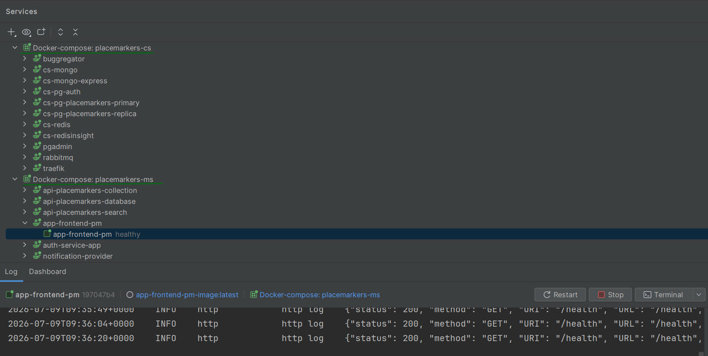

## Инфраструктура и Общие сервисы

- **PHP**: 8.5
- **Фреймворк**: Symfony 8.0 + RoadRunner
- **Управление окружением**: `Makefile` (оркестрация сборки, запуска и инициализации всех микросервисов и инфраструктуры)
- **Traefik**: `v3.6` (Reverse proxy)
- **PostgreSQL / PostGIS**: `17-3.5-alpine` / `17-alpine` (включает pgAdmin4 `latest`, primary / replica)
- **Redis**: `7-alpine` (включает RedisInsight `latest`)
- **RabbitMQ**: `3-management`
- **MongoDB**: `6` (включает Mongo Express `latest`)
- **Buggregator**: `latest`

## Что делает (кратко)

1. Пользователь может делать метки на Yandex карте. Добавлять им названия, тип, теги. И сохранять в базу данных.
2. Пользователь может делать поиск по радиусу. Задать окружность с произвольным радиусом. Применить фильтры поиска. Может сохранять результаты поиска меток и отображать их на карте.   
3) Создавать свой собственный набор тегов.

Также есть функуционал регистрации, смены пароля, авторизации (JWT). 

Вот небольшое демо-видео, которое демонстрирует функционал приложения >>> : [https://disk.yandex.ru/i/xU0GQ61pC3njjQ](https://disk.yandex.ru/i/xU0GQ61pC3njjQ)

Приложение состоимт из слежующих сервисов:

## Микросервисы (main-services)

- [app-frontend](https://github.com/Vlad812/placemarkers-demo-app-frontend.git) — BFF (Backend For Frontend), отдает пользовательский интерфейс (UI) и проксирует запросы к внутренним микросервисам, хранит сессию в Redis.
- [api-placemarkers-database](https://github.com/Vlad812/placemarkers-demo-api-database.git) — сервис записи (CQRS Write Model), отвечающий за создание, обновление и удаление меток (работает с Primary БД PostgreSQL).
- [api-placemarkers-search](https://github.com/Vlad812/placemarkers-demo-api-search.git) — сервис чтения (CQRS Read Model) для быстрого геопространственного поиска меток по радиусу (работает с Replica БД PostgreSQL).
- [auth-service](https://github.com/Vlad812/placemarkers-demo-auth-service.git) — сервис аутентификации и авторизации, отвечает за выпуск и проверку JWT-токенов, регистрацию пользователей
- [notification-provider](https://github.com/Vlad812/placemarkers-demo-notification-provider.git) — сервис уведомлений, асинхронно обрабатывающий отправку писем (через RabbitMQ).
- [api-placemarkers-collection](https://github.com/Vlad812/placemarkers-demo-api-collection.git) — сервис для работы с пользовательскими коллекциями гео-меток (использует MongoDB).

## Что демонстрирует проект

Проект служит примером построения масштабируемого приложения и демонстрирует применение современных архитектурных паттернов на двух уровнях.

### 1. Паттерны микросервисной архитектуры

- **RESTful API**: Взаимодействие между сервисами и клиентами строится на принципах REST с использованием стандартных HTTP-методов и JSON-формата.
- **Stateless Authentication (JWT)**: Авторизация между микросервисами построена на базе JWT (JSON Web Tokens), что позволяет сервисам проверять права доступа без необходимости хранить состояние сессии (stateless).
- **Асинхронное взаимодействие (Event-Driven)**: Использование брокеров сообщений (RabbitMQ) для асинхронной связи между сервисами (например, для отправки уведомлений или фоновой обработки данных), что повышает отказоустойчивость и уменьшает связность (coupling).
- **Polyglot Persistence (Полиглотное хранение данных)**: Использование наиболее подходящего типа базы данных для конкретной задачи. Например, PostgreSQL + PostGIS используется для строгих реляционных и геопространственных данных, а MongoDB — для гибкого документоориентированного хранения (в сервисе `api-placemarkers-collection`).
- **BFF (Backend For Frontend)**: Использование выделенного сервиса (`app-frontend`) для обслуживания клиентского приложения. Он отдает UI и проксирует запросы к внутренним API, скрывая сложность микросервисной архитектуры от браузера.
- **CQRS на уровне системы (Command Query Responsibility Segregation)**: Физическое разделение сервисов для операций записи и чтения. Сервис `api-placemarkers-database` обрабатывает мутации данных (сохраняет в Primary БД), а `api-placemarkers-search` отвечает за быстрый гео-поиск (читает из Replica БД).
- **API Gateway / Reverse Proxy**: Использование Traefik как единой точки входа, маршрутизирующей внешний трафик к нужным микросервисам на основе путей.
- **Database per Service (База данных на сервис)**: Изоляция данных между различными доменами (например, отдельные базы/схемы для авторизации и гео-меток), что обеспечивает независимость сервисов друг от друга.

### 2. Паттерны на уровне приложения (внутри сервисов)

- **DDD (Domain-Driven Design)**: Проектирование, ориентированное на предметную область. Выделение ядра бизнес-логики (Domain) в независимый слой, использование богатых сущностей (Rich Entities) и объектов-значений (Value Objects) для инкапсуляции правил и защиты инвариантов.
- **ADR (Action-Domain-Responder)**: Отказ от классических "толстых" MVC-контроллеров в пользу узконаправленных Actions (один класс — один эндпоинт). Action только принимает HTTP-запрос, передает его в слой приложения и возвращает ответ.
- **Clean Architecture (Чистая архитектура)**: Строгое разделение кода на слои (Infrastructure, Application, Domain). Инфраструктура (HTTP, БД) зависит от бизнес-логики, а не наоборот.
- **CQRS на уровне кода**: Разделение моделей доступа к данным. Использование `Repositories` (Doctrine ORM) для записи и изменения состояния сущностей, и `Fetchers` (сырые SQL-запросы через Doctrine DBAL) для максимально быстрого чтения без накладных расходов ORM.
- **Self-validated DTO (Самовалидирующиеся объекты)**: Использование паттерна Command/Query объектов со встроенной строгой валидацией (через `Webmozart\Assert`) при их создании. В слой бизнес-логики (Handlers) попадают только 100% валидные и типизированные данные.

---

## Используемые Symfony Bundles

В микросервисах используется такие bundles как:

- **BaldinofRoadRunnerBundle**: Интеграция Symfony с сервером RoadRunner для обеспечения высокой производительности.
- **LexikJWTAuthenticationBundle**: Реализация Stateless авторизации через JWT-токены.
- **SecurityBundle**: Базовые компоненты безопасности Symfony.
- **DoctrineBundle & DoctrineMigrationsBundle**: Работа с реляционными базами данных (PostgreSQL) и управление миграциями.
- **DoctrineMongoDBBundle**: Работа с документоориентированной базой данных MongoDB (используется в `api-placemarkers-collection`).
- **MonologBundle**: Единый стандарт логирования.
- **TwigBundle**: Шаблонизатор (используется в BFF `app-frontend` и сервисе уведомлений `notification-provider`).
- **FrameworkBundle**: Базовый каркас Symfony во всех сервисах. (Включает в себя компонент **Messenger** для работы с RabbitMQ).

## Как устроен

### Полная схема архитектуры

Полная схема архитектуры

### Связи сервис → база

Связи сервис → база